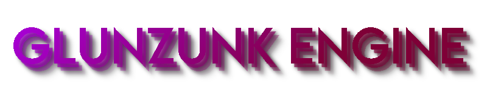

**Glunzunk Engine** is _**100% free**_ open-source, no-code Game Development Software based on [three.js](https://threejs.org), _specfically a Game Engine_.
## 📷 Screenshots 
Not Ready _as of yet..._
## 😄 Getting Started

| ❔ I'd like to... | Description                |
| :-------- | :------------------------- |
| 🔽 Download GZ Engine to make Games |  Goto the itch.io page or Releases page to download it! |
| 💜 Contribute to the Engine ❤ | Install everything in requirements.txt and Python ~3.11 and don't mess up already existing code. |

> Please don't make the code very messy, it's probably already messy enough.

## 📂 File Structure (Source Code) 
| 📄 File | Description |
| :-------- | :-------- |
| 📂 assets | Contains all engine assets like Images, Audio, Fonts, etc. |
| 📂 scripts | Where most required engine scripts reside. |
| 📂 libs | Contains all JavaScript Libaries (including three.js) |
| 📂 projects | GZ Engine Sample Projects |
| 📂 embed-panels | Used by the windowing system in-engine, although will be deprecated eventually |
| main.py | Imports required libaries/modules. Starts the `pywebview` module, triggering the engine to load |
| editor.html | This is the Game Editor, where all the game building takes place! |
| index.html | Glunzunk Engine Home Menu |

## ❓ How GZ Engine Compiles Games?
Your Glunzunk Project is by default, just a collection of JSON files and your game assets.

When building your game, it is first going to be rewritten into JavaScript code that modern browsers should understand and execute.

After building a web build of your game, using tools like Electron, NW.JS, Cordova, etc, you'll be able to export your game to any platform of your choice.

(If your game utilizes python code, it will not be eligible for a web build, unless i figure webaseembly (which is unlikely))

## 💻 How to Compile GZ Engine?
Install all modules in `requirements.txt`
And compile via `pyinstaller`
`pyinstaller` command-line arguments have yet to be determined, as the engine hasn't been compiled before.
## 📎 Links
**Community:**
- [Discord Server](https://discord.gg/YV9XDvRYbw)
- [GitHub Discussions](https://github.com/Official-IceCreeperPE/Glunzunk-Engine/discussions)

**Download:**
- [GitHub Releases](https://github.com/Official-IceCreeperPE/Glunzunk-Engine/releases)
- [itch.io Page](https://mtsyntho.itch.io/Glunzunk-Engine)

**Games made with Glunzunk Engine:**
- You can tag your game with _**glunzunk-engine**_ and be listed [here](https://itch.io/games/tag-glunzunk-engine)!
## [🦡](https://x.com/rogerbadgerman) Badges

[](https://choosealicense.com/licenses/mit/)

[](https://github.com/trekhleb/state-of-the-art-shitcode)
_(Probably doesn't deserve it)_


## 📄 Documentation

[-> Documentation can be found here! <-](https://glunzunk-engine.readthedocs.io) (Hasn't been written as of yet, very outdated)

## 🤔 FAQ

#### Is it really 100% Free?!

Absolutely Yes!! This is a non-profit project.

#### Can I Contribute?

Of course you can! Just make sure you add or fix features that are needed, not only what you want, should benefit others too.

#### Do I need to download the Pre-Made assets?

Nope!


## ✨ Features

- Themes
- Live previews
- Cross-Platform
- No-Code (Optional)
- Custom JavaScript
- Python Support (Native Builds Only)
- Pre-Made Assets
- Ray-Tracing & Path-Tracing (Not guaranteed)
- Shader Editor (Not guaranteed)
- Orthographic and Perspective Camera Options
- Supports Windows, MacOS, Linux, Android and Web


## 💿 Installation

Download Glunzunk Engine zip file, extract and run the executable file.

If you're on Linux and the executable doesn't well... execute(open/run) then in the same directory, open the terminal and run
```bash
chmod +x ./(insert glunzunk engine executable)
```
_**EXCLUDE CURVED BRACKETS AS WELL -> ( )**_

## 💳 License

[MIT License](https://choosealicense.com/licenses/mit/)

Name, Glunzunk Engine itself and The Logo all belong to MTSyntho and may not be claimed as yours or someone elses.


## _Important Note!_
_Many claims in this README.md haven't been implemented nor do we know if they ever will!_

_PS: 'GZ' is an abbreviation of 'Glunzunk Engine'_
